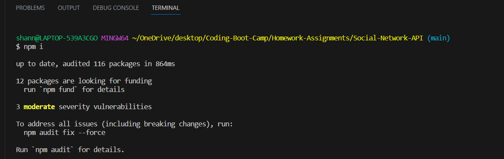
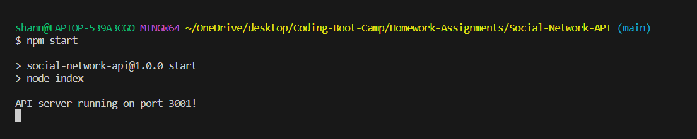
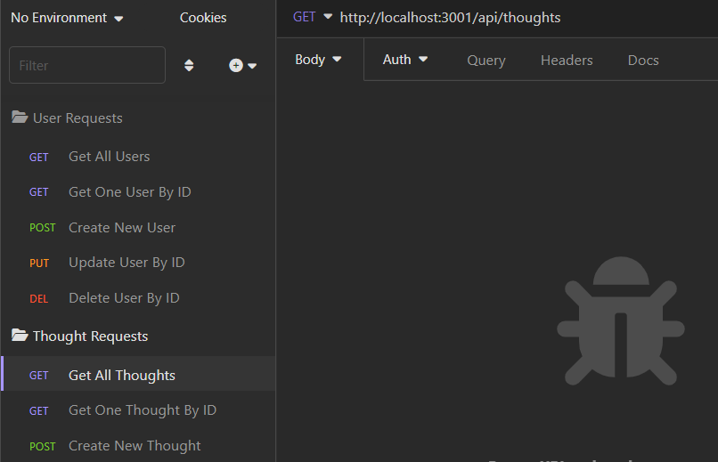

# Social-Network-API
An API for a social network web application where users can share their thoughts, react to friends’ thoughts, and create a friend list. This API uses Express.js for routing, a MongoDB database, the Moment library, and the Mongoose ODM.

## Table of Contents
- [Installation](#installation)
- [Usage](#usage)
- [Credits](#credits)
- [License](#license)
- [Badges](#badges)
- [Tests](#tests)
- [Questions](#questions)

## Installation
To use this project, you will need to install the required dependencies by using the command `$ npm i` in your terminal. 
     

## Usage
You can view a video demonstration of how to use this application [here](https://drive.google.com/file/d/1_LSiqsXY6me9Rzqxd4yxlVGY7DXnK9KG/view?usp=share_link).  
To run the program, use the following command from the root directory in the terminal:  `$ node server.js`  OR   `$ npm start`   
     
The functionality of the application is demonstrated using Insomnia Core. You can find documentation on how to install Insomnia Core [here](https://docs.insomnia.rest/insomnia/install). If you need further information on how to use Insomnia Core, you can find the documentation [here](https://docs.insomnia.rest/insomnia/get-started). Using Insomnia Core, you can follow the appropriate api routes using the dropdown next to the address bar to GET, POST, PUT, and DELETE (read data, create data, update data, and delete data) and by updating the address according to the desired api route. Please refer to the video demonstration for details on each route.  
      

## Credits
Tutorials Followed: 
[Email Validation](https://stackoverflow.com/questions/18022365/mongoose-validate-email-syntax) 
[String Length Validation](https://stackoverflow.com/questions/28829912/mongoose-schema-set-max-length-for-a-string) 

## License
MIT License

## Badges

## Tests
N/A 

## Questions
GitHub Profile: [github.com/shannonkprice00](https://github.com/shannonkprice00) 
For further questions, you can reach me at shannonkprice00@gmail.com